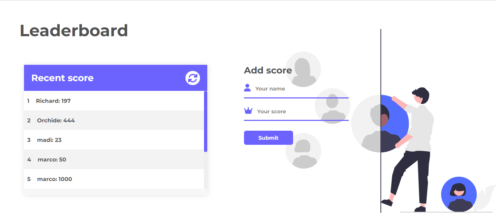

# leaderboard
The leaderboard is a javascript web app that display scores from players. Teh players enter his name and his score the data will be displayed to the screen and thanks to leaderboard API it will be save the way that others can see the classification

## Screenshoot

## see the project
   here is the:  [live_Demo]()

## Built With

-Webpack
- HTML
- CSS
- Javascript
- API

### Prerequisites

clone repo: `git clone https://github.com/Kandy-Peter/leaderboard.git`
### Install

 run `npm install` to install dependencies.
 run `npm install webpack webpack-cli --save-dev` to install webpack

## Command

These commands are here to help you for how to check errors in your code using Linter

*to install the webhint run `npm init -y` to initialize the package and create `package.json`

*to install the stylelint that help you to avoid errors in styles code run:
    `npm install --save-dev stylelint@13.x stylelint-scss@3.x stylelint-config-standard@21.x stylelint-csstree-validator@1.x`
 Then run `npx stylelint "**/*.{css,scss}"` after creating a `.stylelint.json` file

* To install Eslint run `npm install --save-dev eslint@7.x eslint-config-airbnb-base@14.x eslint-plugin-import@2.x babel-eslint@10.x`
And to fix lint errors run `npx eslint .`

## Authors

👤 **Kandi Peter**

- GitHub: [Kandi-Peter](https://github.com/Kandy-Peter).
- LinkedIn: [Kandi-Kamuntu](https://www.linkedin.com/in/kandi-peter-a49590212/).
- twitter: [Kandi_Peter](https://twitter.com/peter_kandy).

